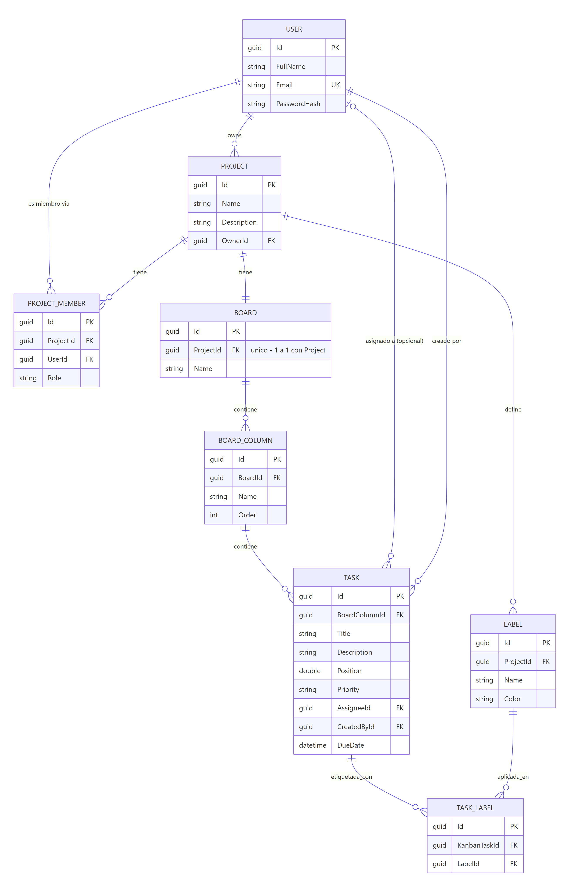

# Tablero Kanban — IdeasGroup

Aplicación de gestión de proyectos estilo Kanban (Scrum board): proyectos con miembros, tableros con columnas y tareas, drag&drop con persistencia de orden, sincronización en tiempo real entre sesiones y exportación de reportes en PDF/Excel.

## Stack

| Capa | Tecnología |
|---|---|
| Backend | .NET 8 · C# · arquitectura hexagonal |
| Persistencia | EF Core 8 · PostgreSQL 16 |
| Tiempo real | SignalR |
| Reportes | QuestPDF (PDF) · ClosedXML (Excel) |
| Auth | JWT (HS256) |
| Frontend | Angular 17 · PrimeNG (template Sakai) · Angular CDK (drag&drop) |
| Infraestructura | Docker Compose (Postgres + backend + frontend/nginx) |

## Puesta en marcha

### Opción rápida: Docker Compose (recomendada)

Requiere Docker Desktop.

```bash
docker compose up -d --build
```

Esto levanta 3 contenedores:

- **postgres** (puerto host `5434`) con healthcheck, volumen persistente.
- **backend** (puerto host `5007`) — aplica las migraciones EF Core y siembra 2 usuarios de prueba automáticamente al arrancar (`ASPNETCORE_ENVIRONMENT=Development` a propósito, para que un `docker compose up` sin pasos manuales deje la app lista para usar — en un despliegue real las migraciones se aplicarían desde CI/CD, no en el arranque del contenedor).
- **frontend** (puerto host `4200`) servido por nginx, que hace de reverse proxy de `/api/*` y `/hubs/*` hacia el backend dentro de la red interna de Docker (por eso no hace falta configurar CORS para este flujo: todo es mismo origen desde el navegador).

Abrir `http://localhost:4200`.

**Usuarios de prueba sembrados:**

| Email | Password |
|---|---|
| `admin@kanban.local` | `Admin123!` |
| `demo@kanban.local` | `Demo123!` |

### Opción desarrollo (sin Docker)

Backend:
```bash
cd backend
dotnet ef database update --project src/IdeasGroup.Kanban.Infrastructure --startup-project src/IdeasGroup.Kanban.WebApi
dotnet run --project src/IdeasGroup.Kanban.WebApi --urls http://localhost:5007
```
Requiere una instancia de PostgreSQL accesible con la cadena de conexión de `appsettings.Development.json`.

Frontend:
```bash
cd frontend
npm install
ng serve --port 4201
```
(`environment.ts` apunta a `http://localhost:5007/api`; usar el puerto que tengas libre y ajustar CORS en `Program.cs` si es distinto de 4200/4201).

### Tests

```bash
# Backend — 47 tests (xUnit)
cd backend && dotnet test

# Frontend — 20 tests (Jasmine/Karma)
cd frontend && npx ng test --browsers=ChromeHeadless --watch=false
```

## Decisiones de arquitectura

### Backend: arquitectura hexagonal (puertos y adaptadores)

Cuatro proyectos con dependencias en una sola dirección (`WebApi → Infrastructure → Application → Domain`):

- **`IdeasGroup.Kanban.Domain`** — entidades y reglas de negocio puras (`User`, `Project`, `Board`, `BoardColumn`, `KanbanTask`...), sin ninguna dependencia externa (ni EF Core, ni ASP.NET). Aquí vive también `TaskPositionCalculator`, la lógica de ordenamiento (ver más abajo).
- **`IdeasGroup.Kanban.Application`** — casos de uso (`AuthService`, `ProjectService`, `BoardService`, `TaskService`, `ReportService`) y **puertos** (interfaces): `IProjectRepository`, `IBoardRealtimeNotifier`, `IReportExporter`, etc. Esta capa no sabe si el tiempo real se implementa con SignalR o si el PDF se genera con QuestPDF — solo conoce contratos.
- **`IdeasGroup.Kanban.Infrastructure`** — **adaptadores**: repositorios EF Core, `JwtTokenGenerator`, `PdfProjectReportExporter`, `ExcelProjectReportExporter`.
- **`IdeasGroup.Kanban.WebApi`** — controllers REST, el hub de SignalR, y el adaptador `SignalRBoardNotifier` (implementa el puerto `IBoardRealtimeNotifier` usando `IHubContext<BoardHub>`).

Ejemplo concreto: `IBoardRealtimeNotifier` (puerto, en Application, 5 métodos como `NotifyTaskCreatedAsync`) es consumido por `TaskService`/`BoardService` sin que ninguno de los dos importe SignalR; el único lugar que conoce SignalR es `SignalRBoardNotifier` (adaptador, en WebApi) y su registro en el contenedor de DI (`Program.cs`). Cambiar el mecanismo de tiempo real (por ejemplo a WebSockets puros o a un broker externo) implicaría escribir un nuevo adaptador y cambiar una línea de DI — cero cambios en Application o Domain.

**Por qué hexagonal:** el dominio (reglas de negocio, cálculo de posiciones, validaciones) es lo más valioso y lo más estable del proyecto; aislarlo de EF Core/ASP.NET permite testearlo con fakes en memoria (así están escritos los 47 tests de backend) sin levantar base de datos, y sin acoplar la lógica de negocio a decisiones de infraestructura que podrían cambiar.

### Frontend: capas por responsabilidad (no hexagonal, es una SPA)

- **`core/`** — modelos, servicios HTTP, guard de autenticación, interceptor JWT. Es la capa de infraestructura del cliente (equivalente liviano al rol de Infrastructure en el backend, pero sin la ceremonia de puertos/adaptadores — no tiene sentido en una SPA de este tamaño).
- **`features/`** — módulos de pantalla reales (`projects/`, `board/`), cada uno con su propio routing module cargado de forma lazy.
- **`demo/`** — el template Sakai original; los módulos de autenticación (`login`, `register`) se reescribieron sobre esta base.
- **`layout/`** — shell, menú lateral y topbar del template.

## Tiempo real: SignalR

Se eligió SignalR (nativo de .NET) sobre alternativas como WebSockets puros o un broker externo (Redis pub/sub, etc.) porque:

1. **Cero infraestructura adicional** — corre dentro del mismo proceso ASP.NET Core, sin un servicio externo que desplegar/mantener.
2. **Grupos por proyecto listos para usar** — `Groups.AddToGroupAsync` permite aislar los eventos de cada proyecto (`project:{projectId}`) sin reinventar un sistema de salas.
3. **Reconexión automática y fallback de transporte** (WebSocket → Server-Sent Events → long polling) manejados por el cliente `@microsoft/signalr` sin código adicional.

**Cómo funciona:** `BoardHub` (`/hubs/board`, `[Authorize]`) expone `JoinProject(projectId)`/`LeaveProject(projectId)`. `JoinProject` **revalida la membresía del usuario contra la base de datos** antes de agregarlo al grupo — no basta con tener un JWT válido, tiene que ser miembro real de ese proyecto, si no lanza `HubException` y el cliente lo recibe como rechazo. Cada mutación exitosa en `TaskService`/`BoardService` dispara un evento (`TaskCreated`, `TaskUpdated`, `TaskMoved`, `TaskDeleted`, `BoardChanged`) al grupo del proyecto vía el puerto `IBoardRealtimeNotifier`.

**Dos problemas reales resueltos durante el desarrollo:**

- El cliente de navegador no puede mandar el header `Authorization` en el handshake de WebSocket, así que el JWT se manda como `?access_token=` en la query string. Hubo que agregar un `OnMessageReceived` al middleware de JWT que solo lee el token de la query string cuando la ruta empieza con `/hubs` (las peticiones REST normales siguen usando el header).
- La configuración de serialización JSON de SignalR (`AddSignalR().AddJsonProtocol(...)`) es **independiente** de la de MVC (`AddControllers().AddJsonOptions(...)`) — el `JsonStringEnumConverter` que hace que `Priority` viaje como `"Medium"` en vez de `2` había que registrarlo en los dos lugares por separado, o los enums viajaban como número solo por el canal de SignalR.

## Estrategia de ordenamiento (drag&drop)

`TaskPositionCalculator` (en Domain, sin dependencias) usa **posiciones fraccionarias (`double`)** en vez de un entero secuencial:

- Al insertar entre dos tareas, la nueva posición es el **punto medio exacto** entre la posición de la tarea anterior y la siguiente (`previous + (next - previous) / 2`).
- Al agregar al final de una columna, la posición es `última + 65536` (el gap inicial). Empezar con un gap grande evita rebalanceos innecesarios en los primeros movimientos.
- **Por qué esto y no reindexar todo en cada movimiento**: reindexar la columna entera en cada drag&drop significa un `UPDATE` por cada tarea de la columna en cada movimiento — con esta estrategia, mover una tarea es **una sola escritura** (`UPDATE` de la tarea movida) en el caso normal.
- El límite es que los gaps se van achicando con movimientos repetidos en el mismo punto. Cuando el gap resultante cae debajo de `1e-6`, `CalculatePosition` lanza `RebalanceRequiredException`; el caller (`TaskService.MoveAsync`) la captura, reconstruye el orden completo de la columna in-memory (insertando la tarea movida en su índice correcto) y llama a `Rebalance(count)`, que reasigna posiciones limpias `(i+1) * 65536` a **todas** las tareas de esa columna en un solo `UpdateRangeAsync`. Este caso es raro (requiere decenas de inserciones exactamente en el mismo punto) y solo paga el costo de reindexar cuando realmente hace falta.
- El endpoint (`PUT .../tasks/{taskId}/move`) no recibe una posición numérica: recibe los **IDs de los vecinos** (`previousTaskId`/`nextTaskId`) tal como están ordenados en el cliente en ese momento. Esto mantiene el detalle de implementación (que la posición es un `double`) completamente fuera del contrato HTTP.

Este algoritmo tiene su propio test dedicado (`TaskServiceTests`, backend) que verifica tanto el cálculo del punto medio exacto como el disparo del rebalanceo y el resultado final correctamente ordenado y espaciado.

## Exportación dual (PDF / Excel)

Ambos formatos se generan desde **una sola consulta** (`ReportService` arma un `ProjectReport` con las filas ya ordenadas por columna y posición, igual que se ven en el tablero) usando **patrón Strategy**:

- `IReportExporter` es el puerto: `Format` (enum) + `Export(ProjectReport)`.
- `ReportService` recibe `IEnumerable<IReportExporter>` por inyección de dependencias y los indexa en un diccionario por `Format` en el constructor.
- `PdfProjectReportExporter` (QuestPDF) y `ExcelProjectReportExporter` (ClosedXML) son las dos implementaciones actuales, ambas en Infrastructure.

Agregar un tercer formato (por ejemplo CSV) es **una clase nueva + una línea de registro en DI** — cero cambios en `ReportService`, en el controller, ni en el DTO `ProjectReport` (principio abierto/cerrado).

## Modelo de datos



Notas sobre el esquema real (no simplificado):

- `Project` ↔ `Board` es **1 a 1** (cada proyecto crea su tablero automáticamente al crearse, con 3 columnas por defecto: "Por hacer", "En progreso", "Hecho").
- `Task` ↔ `Label` es **N a N** a través de una tabla puente real (`TaskLabel`, con su propio `Id`, no una clave compuesta) — endpoints de asignación de labels quedaron fuera del alcance obligatorio de esta entrega.
- `Task.AssigneeId` es opcional (`ON DELETE SET NULL`); `Task.CreatedById` es obligatorio (`ON DELETE RESTRICT`, no se puede borrar un usuario que creó tareas).
- Índices relevantes: `User.Email` único; `(ProjectId, UserId)` único en `ProjectMember`; `ProjectId` único en `Board` (fuerza el 1 a 1); `(ProjectId, Name)` único en `Label`; `(BoardColumnId, Position)` compuesto (no único) en `Task`, para acelerar la lectura ordenada de cada columna.
- Todos los `Id` son `Guid` generados en memoria (`Guid.NewGuid()`), no identity de base de datos.

Todo el esquema nace en una única migración EF Core (`InitialCreate`).

## Uso de IA

Este proyecto se desarrolló con asistencia de **Claude Code** (Anthropic) a lo largo de todas las capas: scaffolding inicial, implementación de backend y frontend, debugging (por ejemplo, un bug real de EF Core al agregar hijos a un agregado ya trackeado, un crash del renderer de Angular causado por llamar a un método directamente en un binding de template, y un bug de build de Docker por falta de `fileReplacements` en `angular.json` que hacía que el frontend empaquetado siguiera apuntando a `localhost` en vez de usar rutas relativas), redacción de tests, y este mismo README. Todo el código fue revisado y probado manualmente, incluyendo verificación end-to-end contra la app real, no solo tests.
